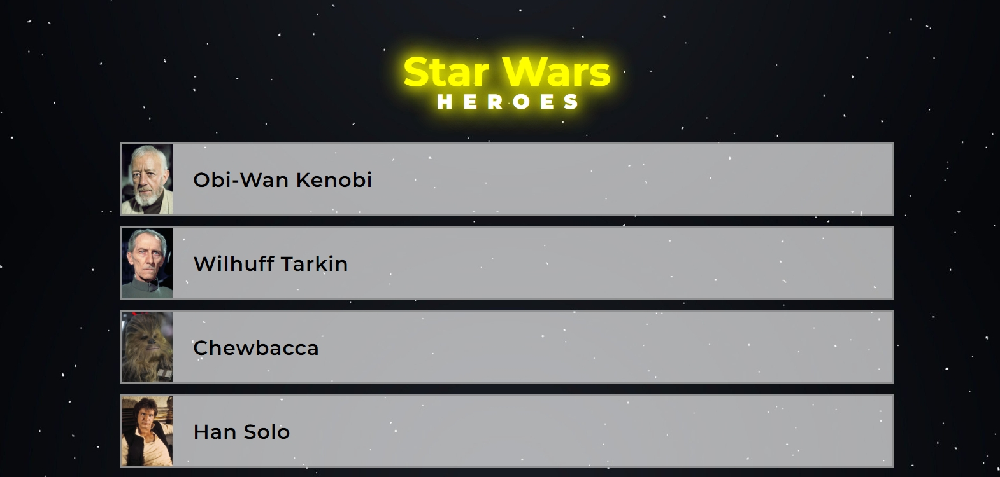
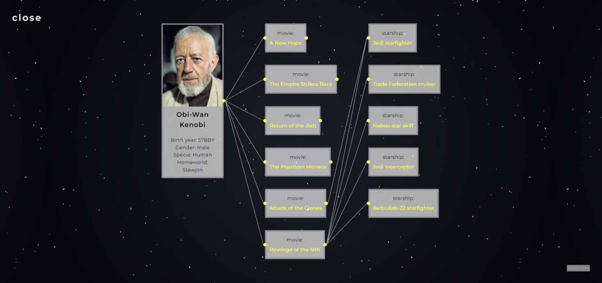

# Star Wars Heroes

The StarWars Heroes project is built with React JS and serves as a catalog of heroes from the Star Wars movies. It lets you browse all the characters featured in the films and view detailed information on each hero, such as the movies they appeared in and the starships they piloted.

## 🏃‍♂️ Running the Project

You can view the assembled website: [starwars-heroes-six.vercel.app](https://starwars-heroes-six.vercel.app/)

1. Clone the repository to your local machine.
2. Run `npm install` or `yarn` in the project directory to install the required dependencies.
3. Run `npm run dev` or `yarn dev` to get the project started.

## 🏃‍♂️ Running the Unit Test

## 📦 Technologies

- `Type Script`
- `React`
- `Vite`
- `TanStack Router`
- `TanStack Query`
- `Axios`
- `HTML & CSS`

## 🪓 Features & Process

**Іnfinite scroll**: It’s a mechanism that turns content into a continuous feed. As you scroll, new pages (or items) of characters appear. This is implemented using **TanStack Query**. TanStack Query supports a helpful version of useQuery called useInfiniteQuery, ideal for querying these types of lists.
How it works: We receive data from the server, divided into multiple pages (or groups). Waiting for useInfiniteQuery to request the first group of data by default. Returning the information for the next query in getNextPageParam. Calling fetchNextPage function

**Routing**: I decided to use **TanStack Router**. Like many advanced routers, TanStack Router supports nested routes, allowing you to create a structure of parent and child routes that reflect the hierarchy of your application’s UI.
It also supports automatic route generation if you follow a specific structure. Additionally, it includes **TanStack Router Devtools**, which can be enabled in this project. The devtools allow developers to see the current route structure, including nested routes, making it easier to understand and debug complex routing setups.

**Graphs**: Using React Flow, I created interactive graphs for each character. These graphs display the main character along with the movies they appear in and the starships they traveled on in specific films. Additionally, the graph is interactive: nodes can be moved, and new edges can be created.

**UI**: The UI is designed for maximum ease of use. There’s a list of hero cards that load gradually, each displaying the hero’s photo and name. The graph is also positioned for optimal user experience. To enhance the theme, a starry sky background adds a Star Wars atmosphere, while the blocks are styled to blend harmoniously with this background. A main title has also been added, which draws attention and is highlighted.

**Adaptive Design**: The website is fully adaptive, ensuring that it is responsive and optimized for viewing on all devices, from desktops to tablets and smartphones.

## 📚 What I Learned?

In this project, I used **TanStack Query** and **TanStack Router** for the first time. Since these are modern tools built on current approaches and solutions, I wanted to give them a try—and they’re genuinely pleasant and straightforward to use.

I also used the **React Flow** library for the first time. It’s an impressive tool for creating high-quality, visually appealing graphs, though getting the most out of it requires a solid understanding of its documentation and features.

## 📈 Overall Growth:

This project sharpened my ability to tackle complex challenges, introduced me to new tools and techniques, and significantly enhanced my skills for future work. It provided me with valuable hands-on experience in programming, allowing me to grow as a developer.

## ⭐ How can it be improved?

-   Add filters, such as by the first letter of the name.
-   Implement the ability to mark favorite characters, store this in local storage, and display the list with favorites at the top.
-   Improve the graphs so they adjust their layout on devices with smaller screen widths for better UI.
-   Add additional nodes to the graphs, such as planets.
-   Add more brightly coloured tables and interactivity, for example, add elements that can be manually illuminated like a 'Jedi sword'

## 😍 Performance

